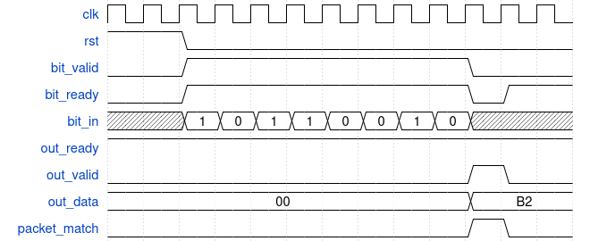
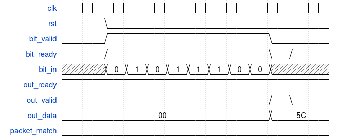
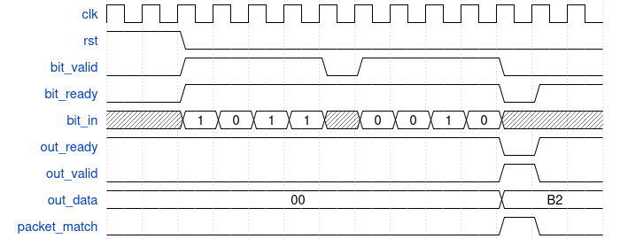

# ECE411 OA

Quick TIP: You can view this readme in a better format on VSCode using `Ctrl+Shift+V`

## Part 1. MCQ

[Go to this link to take the first part of the OA and later to turn in your rtl](https://www.youtube.com/watch?v=dQw4w9WgXcQ)

## Part 2. RTL Serial Packet Deserializer with Header Match

### Problem Overview

You are given a serial input stream where data arrives **one bit at a time**. Your task is to design a deserializer that collects every 8 valid input bits and produces one 8-bit output byte.

The input bits arrive **MSB first**, meaning the first bit received becomes bit 7 of the output byte, and the last bit received becomes bit 0.

Once a full byte has been assembled, the module should output the byte and check whether it matches a fixed packet header pattern.

The header pattern is provided as a parameter and you should not change it:

```systemverilog
localparam logic [7:0] MATCH_PATTERN = 8'b1011_0010;
````

If the completed byte matches this value, the module should assert `packet_match`.

# **Note that the provided testbench may not test full functional behaviour**

### Signal Description

| Signal         | Direction | Description                                                |
| -------------- | --------- | ---------------------------------------------------------- |
| `clk`          | Input     | Clock signal                                               |
| `rst`          | Input     | Active-high reset                                          |
| `bit_valid`    | Input     | Indicates that `bit_in` is valid                           |
| `bit_ready`    | Output    | Indicates that the module can accept a bit                 |
| `bit_in`       | Input     | Serial input bit                                           |
| `out_ready`    | Input     | Indicates that downstream logic can accept the output byte |
| `out_valid`    | Output    | Indicates that `out_data` is valid                         |
| `out_data`     | Output    | Completed 8-bit deserialized byte                          |
| `packet_match` | Output    | High when `out_data` matches the packet header             |


### Functional Requirements

- Bits arrive serially, one bit per cycle.
- A bit is only captured when `bit_valid` and `bit_ready` are true.
- Bits arrive **MSB first**.
- Every 8 accepted bits form one output byte.
- When a full byte is assembled:
   * `out_valid` should become high.
   * `out_data` should contain the completed byte.
- `out_data` should remain stable while `out_valid` is high and `out_ready` is low.
- The module should not accept more input bits while an unconsumed output byte is waiting.
- On reset:
   * `out_valid = 0`
   * `out_data = 0`
   * `packet_match = 0`
   * internal counter and shift register are cleared.

---


### Example 1: Header Match



Bits arrive MSB first. out_valid and packet_match assert after the 8th accepted bit.

### Example 2: Header Mismatch 



The completed byte is 8'h5C, so packet_match remains low.

### Example 3: Data Error 




stalling the input stream


### Layout

- `rtl/`: RTL module stub.
- `tb/`: self-checking testbench.

### Usage

```sh
make sim            # Simulate the design and see if it passes all testcases
make help           # list of makefile targets just incase you need them
```

